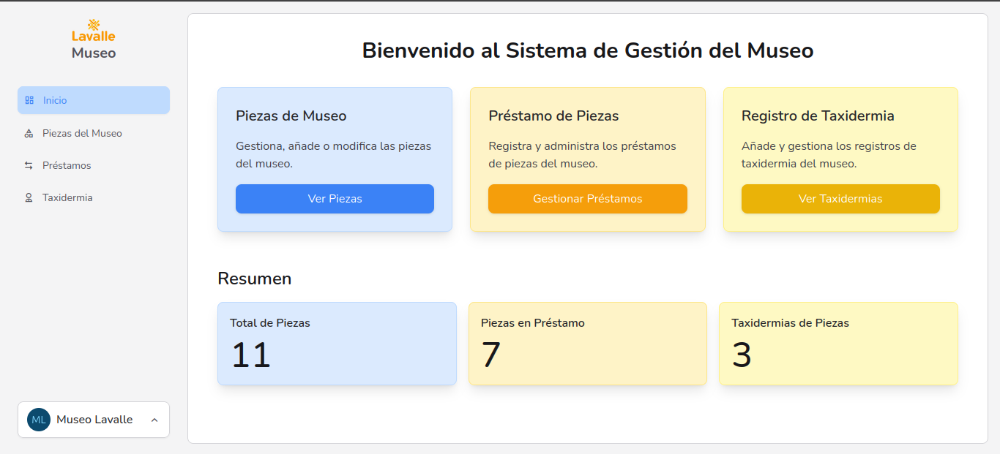

# Museo Lavalle: Gestión de Piezas

**Museo Lavalle** es una aplicación web diseñada para optimizar la gestión de piezas del Museo del Departamento de Lavalle, Mendoza. Esta herramienta digital e interactiva permite al personal:

* Realizar un seguimiento detallado de las piezas del museo.
* Gestionar el registro de préstamos.
* Supervisar el procesos de taxidermia.

Con esta solución, el personal del museo puede llevar a cabo su labor de manera más eficiente, ordenada y accesible, promoviendo una administración moderna y profesional del patrimonio cultural.

Museo Lavalle es una aplicación web, que busca facilitar la gestión de las piezas en el Museo del departamento de Lavalle, Mendoza. Dando herramientas de seguimiento de las piezas, registro de prestamos y de taxidermias. Otorgandole al personal una forma de llevar el labor de gestión de forma digital y interactiva.
